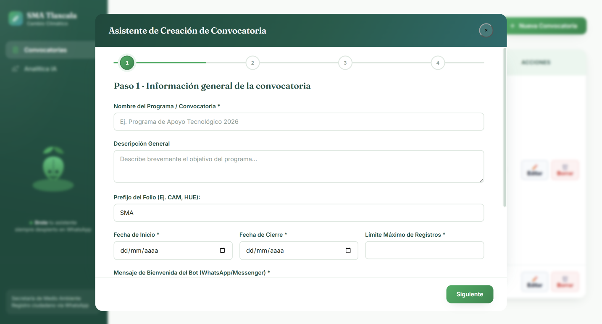

# ConvocaBot AI 🌿

**Sistema de registro ciudadano con WhatsApp, inteligencia artificial y panel administrativo web — desarrollado para la Secretaría de Medio Ambiente del Estado de Tlaxcala.**

---

## ¿Qué es esto?

ConvocaBot AI es una plataforma completa de gestión de convocatorias gubernamentales construida íntegramente sobre Google Workspace, sin servidores propios ni costos recurrentes. Permite a ciudadanos registrarse en programas ambientales a través de WhatsApp, mientras el equipo administrativo gestiona convocatorias, visualiza datos y genera reportes inteligentes desde una aplicación web.

El sistema nació de un problema real: el Departamento de Cambio Climático de la SMA Tlaxcala capturaba registros manualmente con Google Forms, obteniendo datos incompletos, preguntas abiertas donde debían ser cerradas y sin forma de consultar estatus. Este proyecto lo resuelve de punta a punta.

---

## Stack técnico

| Capa | Tecnología |
|---|---|
| Backend | Google Apps Script (JavaScript) |
| Base de datos | Google Sheets |
| Almacenamiento | Google Drive |
| Mensajería | WhatsApp Business Cloud API (Meta) |
| Inteligencia artificial | Gemini API (Google AI Studio) |
| Frontend | HTML5 + CSS3 + JavaScript vanilla |
| Autenticación | Google OAuth 2.0 (via Apps Script) |

**Sin frameworks. Sin dependencias externas. Sin servidor que mantener.**

---

## Arquitectura

```
Ciudadano (WhatsApp)
        │
        ▼
Meta Cloud API
        │  webhook POST
        ▼
Apps Script Web App (doPost)
        │
        ├── gs_Bot.gs        — motor de conversación con máquina de estados
        ├── gs_Sesiones.gs   — CacheService + Sheets como respaldo
        ├── gs_Enviar.gs     — mensajes de texto, botones interactivos y listas
        ├── gs_Webhook.gs    — cola de mensajes, descarga de media a Drive
        └── gs_Municipios.gs — catálogo de 60 municipios de Tlaxcala
                │
                ▼
        Google Sheets (BD central)
        ├── Convocatorias    — esquema JSON de preguntas por convocatoria
        ├── Registros        — respuestas ciudadanas con folio único
        ├── Sesiones         — estado de cada conversación activa
        └── MapaCarpetas     — mapeo pregunta → carpeta en Drive

Panel web (Apps Script HTML Service)
        ├── Wizard de 4 pasos — crear convocatorias con builder visual
        ├── Vista de registros — tabla con filtros y búsqueda
        ├── Reportes IA       — análisis con Gemini API
        └── Administrar       — editar convocatorias activas
```

---

## Funcionalidades principales

### Bot de WhatsApp
- Flujo conversacional dinámico generado desde el esquema configurado en el panel web, sin código estático
- Ramificaciones condicionales: preguntas distintas según la modalidad elegida
- Tipos de campo con validación automática: CURP, teléfono, correo, numérico, opción múltiple, archivo
- Subida de archivos (PDF e imágenes) a carpetas organizadas en Google Drive, nombradas con el CURP del ciudadano
- Menús interactivos nativos de WhatsApp (botones y listas) para opciones de hasta 3 elementos
- Selector de los 60 municipios de Tlaxcala como lista interactiva de WhatsApp
- Resumen de respuestas antes de confirmar el registro
- Verificación de duplicados por número de teléfono
- Manejo de sesiones con expiración automática a las 6 horas
- Generación de folio único con concurrencia segura vía `LockService`
- Comandos globales: `CANCELAR`, `AYUDA`, `CONTINUAR`, `ESTATUS [folio]`
- Respuesta automática cuando la convocatoria está pausada o cerrada

### Panel administrativo web
- **Wizard de 4 pasos** para crear convocatorias sin tocar código:
  - Paso 1: metadatos (nombre, fechas, límite de registros, mensajes del bot)
  - Paso 2: constructor visual de preguntas (drag & drop, bloques inteligentes)
  - Paso 3: preview de la infraestructura que se creará (carpetas Drive, columnas Sheet)
  - Paso 4: deploy automático (crea carpetas en Drive, Sheet de respuestas con formato profesional)
- **Control de estado** de convocatorias: ACTIVA → PAUSADA → CERRADA desde un selector en la tabla
- **Sheet de respuestas** generado automáticamente con encabezados con color, filas de ayuda, validación de estatus, formatos condicionales y columnas ancladas
- **Reportes con Gemini AI**: análisis de datos de registros con lenguaje natural

### Diseño multi-convocatoria
- Cada convocatoria genera su propio Spreadsheet de respuestas y carpeta en Drive
- El esquema de preguntas vive como JSON en Sheets, no en el código
- Agregar una modalidad nueva o cambiar una pregunta no requiere modificar código
- El bot siempre lee el esquema vigente en tiempo de ejecución

---

## Decisiones de arquitectura relevantes

**¿Por qué Apps Script y no Node.js o Python?**
El equipo de la SMA no tiene infraestructura de servidores ni presupuesto para hosting. Apps Script corre en la nube de Google, es gratuito dentro de los límites de uso del programa y no requiere mantenimiento técnico. El equipo puede actualizar convocatorias desde la interfaz web sin depender de un desarrollador.

**¿Por qué Sheets como base de datos?**
Los datos deben ser accesibles directamente por el equipo administrativo sin intermediarios. Sheets permite que cualquier persona del departamento vea, filtre y exporte registros sin necesitar acceso a una base de datos técnica.

**¿Por qué CacheService + Sheets para sesiones?**
CacheService (`MemoryCache`) es de acceso inmediato (< 50ms) y evita que el bot tarde 2-3 segundos leyendo Sheets en cada mensaje. Sheets actúa como respaldo persistente para sesiones largas que superan el TTL del caché.

**¿Por qué LockService para los folios?**
`LockService.getScriptLock()` serializa las escrituras concurrentes. Sin él, dos registros simultáneos podrían obtener el mismo número de folio. El lock garantiza unicidad incluso en picos de demanda.

---

## Estructura del proyecto

```
/
├── main.gs                  — doGet, doPost, funciones del servidor
├── gs_Bot.gs                — motor de conversación y validaciones
├── gs_Webhook.gs            — recepción de webhooks Meta, descarga de media
├── gs_Sesiones.gs           — gestión de sesiones (caché + Sheets)
├── gs_Enviar.gs             — envío de mensajes, botones y listas a WhatsApp
├── gs_Municipios.gs         — catálogo de 60 municipios de Tlaxcala
├── ui_Index.html            — shell de la SPA, carga de componentes
├── ui_Styles.html           — CSS global (paleta verde institucional)
├── ui_State.html            — estado en memoria del wizard
├── ui_API.html              — capa de comunicación con el servidor
├── ui_Router.html           — navegación entre vistas
├── ui_Utils.html            — modal, toast, helpers
├── view_Convocatorias.html  — listado y control de convocatorias
├── view_Wizard.html         — contenedor del wizard de 4 pasos
├── wiz_Paso1.html           — metadatos de la convocatoria
├── wiz_Paso2.html           — constructor visual de preguntas
├── wiz_Paso3.html           — preview de infraestructura
├── wiz_Paso4.html           — deploy y activación
└── comp_Sidebar.html        — menú lateral de navegación
```

---

## Variables de entorno (Propiedades del script)

```
WA_TOKEN        — Token permanente de Meta Business API
WA_PHONE_ID     — Phone Number ID del número de WhatsApp
VERIFY_TOKEN    — Token de verificación del webhook
GEMINI_KEY      — API key de Google AI Studio
SPREADSHEET_ID  — ID del Spreadsheet central (base de datos)
```

---

## Capturas

> *Panel de convocatorias con control de estado*


> *Wizard — Paso 2: constructor visual de preguntas*



> *Conversación real en WhatsApp con botones interactivos*

> *Sheet de respuestas generado automáticamente con formato institucional*

---

## Contexto del proyecto

Desarrollado para el **Departamento de Cambio Climático** de la Secretaría de Medio Ambiente del Estado de Tlaxcala como parte del programa **Tlaxcala Resiliente 2026**, que entrega árboles frutales, jardines polinizadores y huertos de ciclo corto a ciudadanos e instituciones educativas del estado.

El sistema reemplazó un proceso manual basado en Google Forms con preguntas abiertas, captura duplicada de datos y sin trazabilidad de estatus. El objetivo fue cero costos operativos recurrentes y autonomía total del equipo para gestionar convocatorias futuras sin dependencia de desarrolladores externos.

---

## Autor

Desarrollado por **Fátima Ávila y Alex Cervantes** — Desarrolladora de software con enfoque en soluciones de bajo costo para gobierno y sector público.

[](https://linkedin.com)
